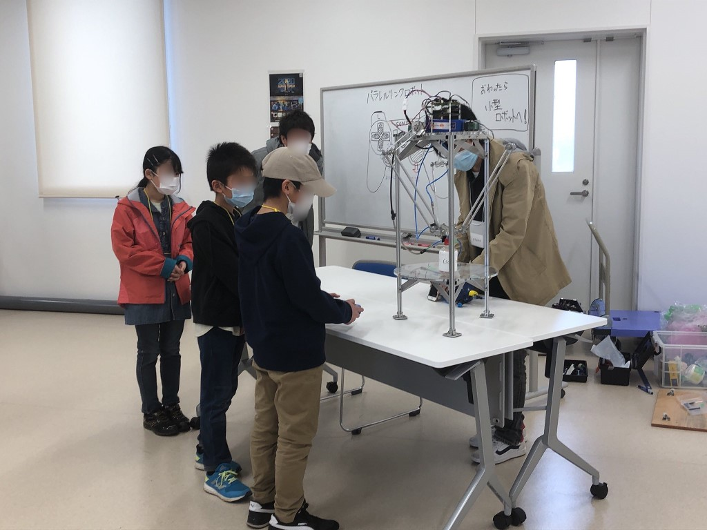
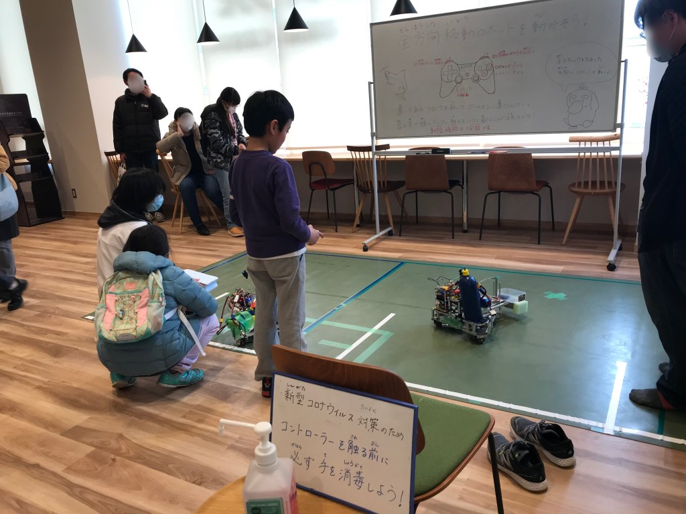
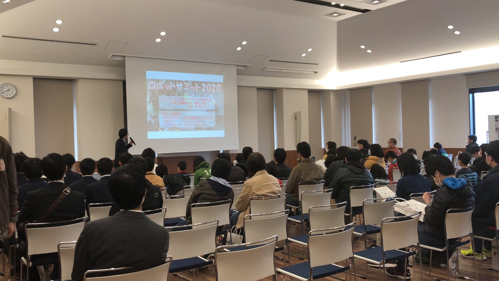
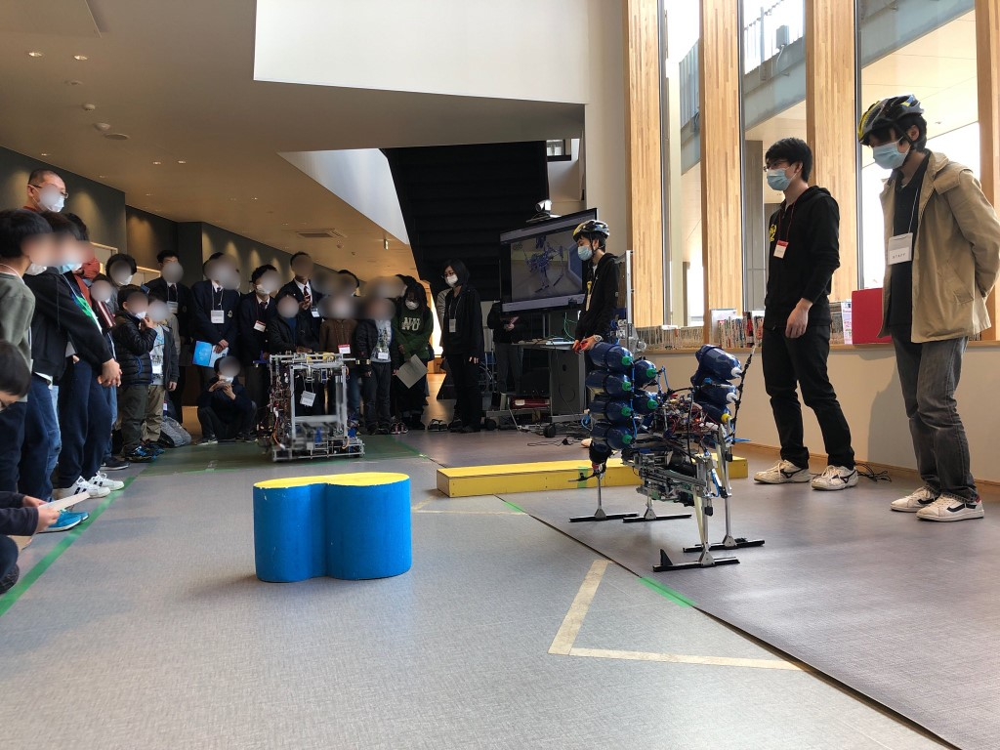

お久しぶり...と言っても3ヶ月([科学の祭典](https://www.fortefibre.net/blog/?p=3920))ぶりですね.  
広報イベントでよく登場するにーしゃです.

私達はタイトルにあるように毎年恒例綾部市主催で開催される「ロボットサミット2020」に参加してきました！

弊学から出展させていただいた具体的な内容と致しましては以下の通りです.

- 顧問による講演
- 操縦体験
    - パラレルリンクロボット
    - 小型ロボット
- NHK学生ロボコン2019出場機体によるデモ

パラレルリンクロボットは弊部の広報用ロボットとしてよく登場してますね.

パラレルリンクロボットの操縦体験

小型ロボットというのは[SRC](https://www.fortefibre.net/blog/?p=3807)で活躍していたロボットのプログラムを広報用に書き換えたものです.

小型ロボットの操縦体験

[京都府にまとめていただいたサイト](https://www.pref.kyoto.jp/sangyo-sien/nicc/robot2020-rep.html)もあるので是非ご覧ください！

子供達から高校生,大人の方まで参加していただいた皆さん楽しそうにしていただいてこちらとしてもとっても楽しかったです！

他にもScrambleさんによるロボマス機体の操縦体験や大槻ポンプ工業さんのVR消化システムなどもあり,ロボット好きなら絶対楽しい内容となっています.  
夏開催になるかも知れませんが来年もおそらく開催するので気になった人は是非参加してみてください！

ここで興味を持ってくれた人が弊部に入ってくれることを願いつつ今回は講演の様子とデモの様子の画像を貼ってお別れとさせていただきます.

招いてくださった綾部市の皆様,ロボットサミットに来てくださった皆様,関係者各位ありがとうございました.

ではまた！

弊部顧問による講演

NHK学生ロボコン2019出場機体によるデモ
