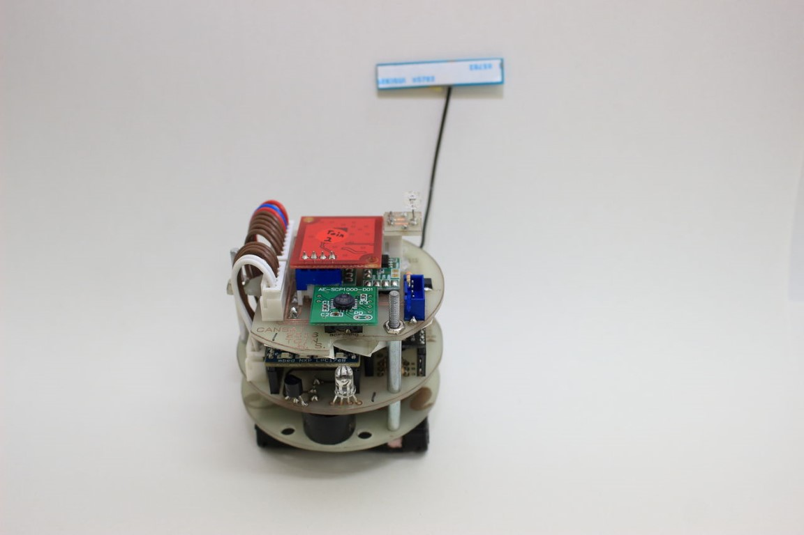
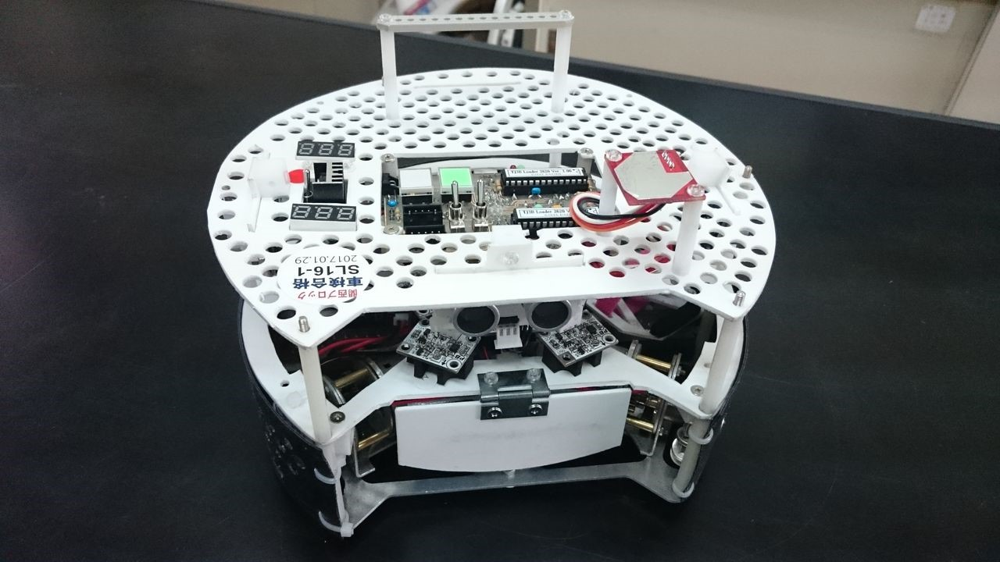

お久しぶりです，かのーです．  
新入生の皆さん，京都工芸繊維大学に入学おめでとうございます．  
学長のコメントが大学HPで公開されていますので，ぜひご確認ください．  
  

さて，新歓ブログの第５回となるこの記事ですが，どのサークルに入るかの手助けになれば幸いです．

今回はForteFibreと電子システム工学課程について紹介したいと思います．

## ForteFibreについて

私がForteFibreに入部したきっかけは”もともとロボットなどを制作してきたから”です．存在自体は入試を受ける前から知っていました．  
  
中学・高校で自立型サッカーロボットや，空き缶サイズの人工衛星'缶サット'を制作し，RCJ Soccer競技や缶サット甲子園などに出場していました．

作成した缶サット．サイズは350mlの空き缶サイズです．

ラジコンではなく，搭載しているセンサの値をもとにマイコンで制御して自動で動きます．

ものづくりを中学・高校の６年間で行っていた私は技術や勘を鈍らしたくないことや，大学に入ったらNHK学生ロボコンなどに参加したいと考えていたので，迷うことなく入部を決めました．

入部して１年が経ちますが，部内ではロボットの制御コードを作成したり，ロボットに搭載する基板の設計を行ってきました．  
当たり前といえば当たり前なのですが，ForteFibreでは豊富な機材があるので技術力をたかめることができます．また先輩を始めOB・OGの方と交流する機会がたくさんあります．  
一人で活動を行うとこれらのメリットは享受できませんので，経験者の方も入部すると楽しいですよ？

## 電子システム工学課程について

よく，情報は光で電子は闇といったりします．  
電子の一回前期は地獄だと言われますが，本当にそのとおりでした．(今から思うとそうでもなかった気もしますが…)  
ほぼ毎日1限から開始の授業，遅刻や欠席すると詰む実験など目まぐるしい1週間を過ごすことになると思います．

しかし，そのような授業は回路設計を行う際にとても役に立ちます．  
上回生になってから学ぶ内容を基板作成の際にまず学びますので，後々の授業で結びつきを感じることができると思います．

もし回路や制御に興味があれば'トランジスタ技術'という本を定期購読する事をおすすめします．毎月様々なテーマが取り上げられており，基板製作のいろはや，カルマンフィルターなどを特集していたこともありますので毎月飽きることなく読むことができるともいます．

長々と書いてきましたが，伝えたかったことは次の２つです．  
・ロボコン楽しいよ！！！！！  
・是非入部をお待ちしております

以上かのーがお送りしました．  
ご自愛くださいませ．
