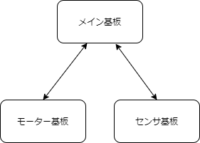

新入生のみなさん、ご入学おめでとうございます。

情報工学課程の3回生で、ソフト班のピラニアです。コロナのせいで全く進級した実感が湧かないですが  
昨日の担当のひらめくんとはForteFibre魚類班の仲間として、日々仲良く過ごしています。  
そんなひらめくんの記事はこちら↓↓

[新歓ブログ機械工学課程3回](2020-04-08)

さて、ここからはロボコンの活動について書いていきたいと思います。

弊部では部員は大きくハード班とソフト班に分かれて活動しています。

ハード班はロボット本体を設計し、材料を加工し、そして組み立てるという役割を果たしています。  
それに対し、ソフト班は基板を作り、ロボットの配線を行い、そしてロボットの動作をプログラミングする役割を果たします。

簡単に言えば、ハード班は**ロボットの体を作る**役割を、ソフト班は**ロボットの頭脳を作る**役割を果たしています。

所属する班は本人の希望のみで決められ、課程や学年による縛りはありません。現在の部員の中には情報工学課程でハード班に所属している人もいます。

それで、私は最初に書いたとおりソフト班に所属しています。主にしているタスクは基板のファームウェアを書くことです。と書くとまあ全くどんなことやってるのかわからないと思うので、ちょっと詳しく説明していきます。

弊部では1台のロボットに複数の基板が搭載されています。センサを読むための基板やモーターを制御するための基板といったような用途別の基板が複数あり、それを組み合わせて1台のロボットに必要な電装を行うわけです。

簡単なイメージ図。  
実際にはもっと様々な種類があり、  
使う枚数も多いです。

基板にはそれぞれコンピューターが搭載されており、各機能の制御や他の基板との通信を行っています。そして僕が書いているのは上の図のモーター基板やセンサ基板で使うプログラムです。

ロボットをメインで制御しているわけではないので、派手な役回りではないですが、この部分がないとロボットが動きません。縁の下の力持ち的な役回りで個人的には割と気に入っています。

さて、あまりブログを長くしてもアレなので最後に僕が入部した理由と面白かった授業を書いて締めたいと思います。

僕がForteFibreに入部した理由は...ずばり、**面白そうだったから!** これに尽きます。というかこれ以外の理由がないですね。ロボコンって単語に憧れません?  

それはさておき当時の僕は特にプログラミングに詳しいわけでも回路に詳しいわけでも機構に詳しいわけでもありませんでした。それでも頼りになる先輩や同回生のおかげでここまで続けて来ることができました。何も知らないことはロボコンへの入部をためらう理由ではありません。

面白かった授業はいくつかありますが......そうですね、ここでは2つほど紹介したいと思います。

1つ目は2回生の「組込みシステム設計論」という授業です。先生が良いのもさることながら、毎回、解体Showと題して身近なゲーム機から車まで様々な機器を分解してその特徴を解説するコーナーがとても良かったです。

2つ目はこれも2回生の「ものづくり加工実習」という授業です。学内にある施設を使って、実際にものづくりの現場で行われている加工を体験することができます。自分用のペーパーナイフも作れますよ!

それでは、今回のブログはここまでで。  
次は部室で会えることを願っています。
