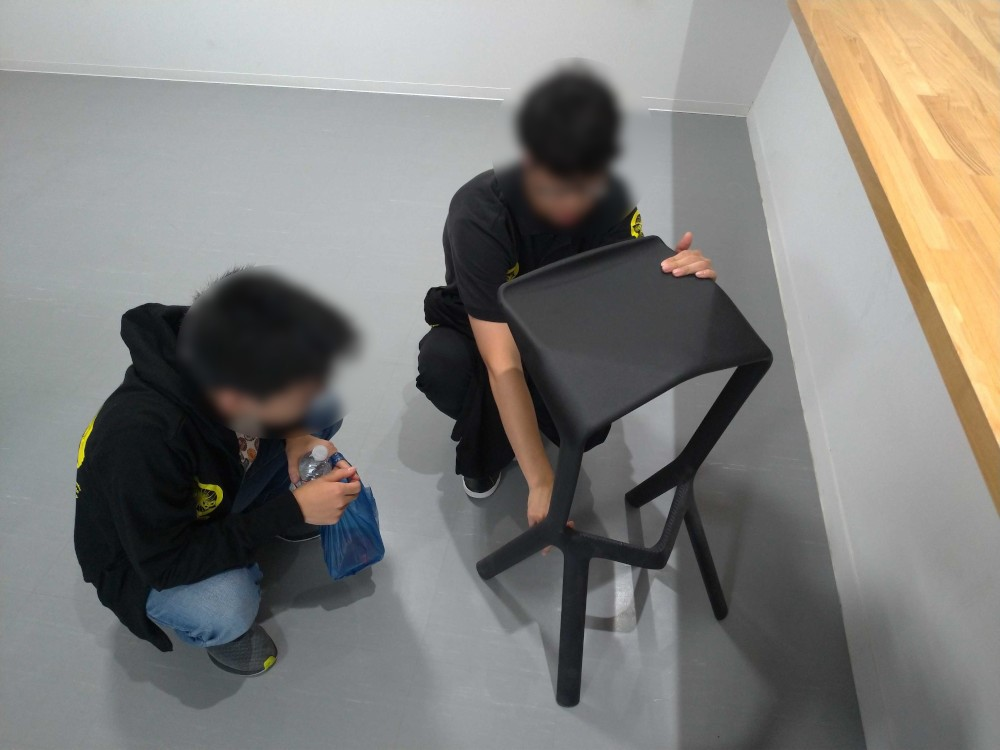
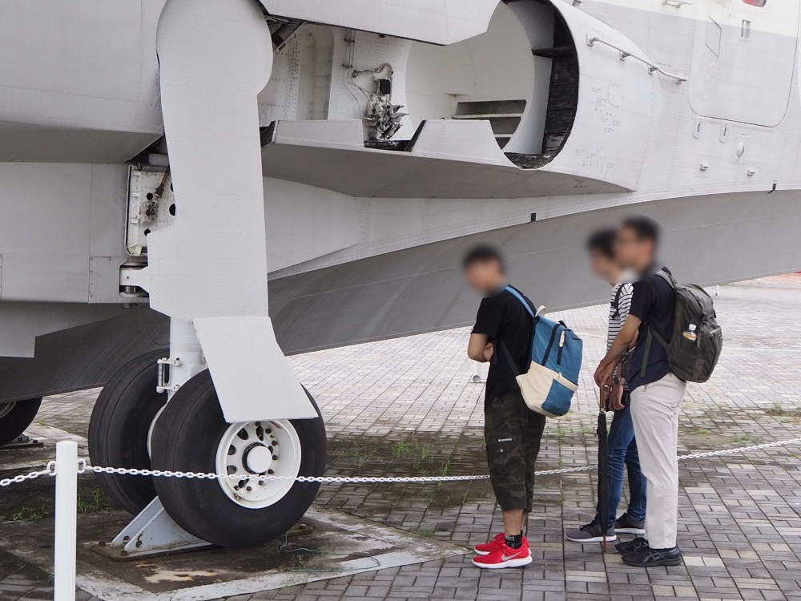
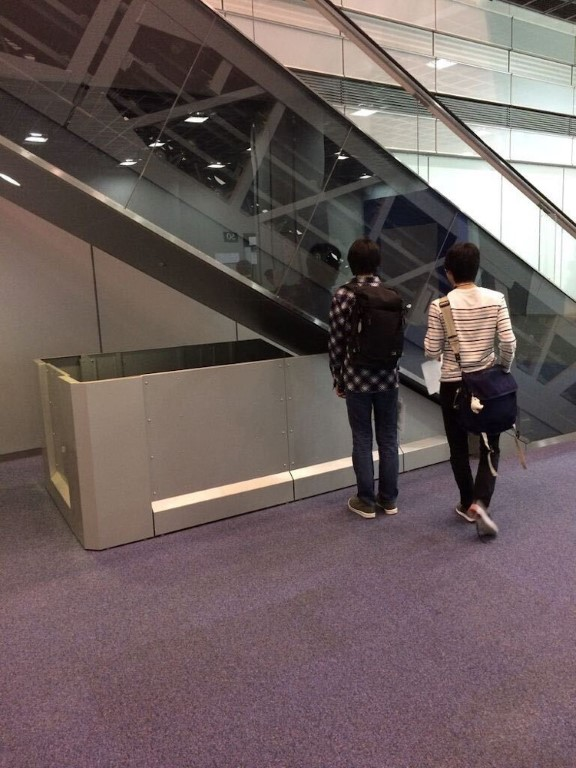
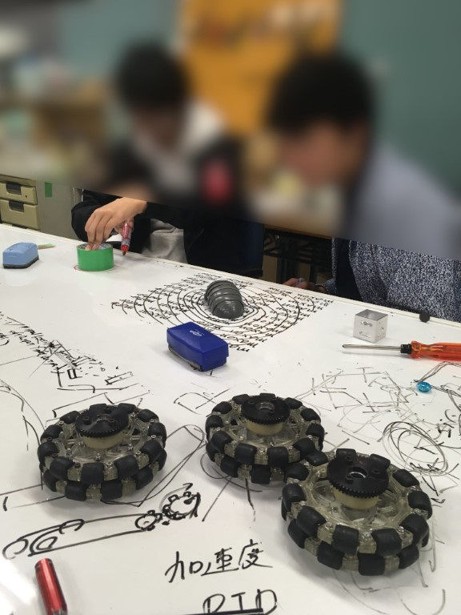
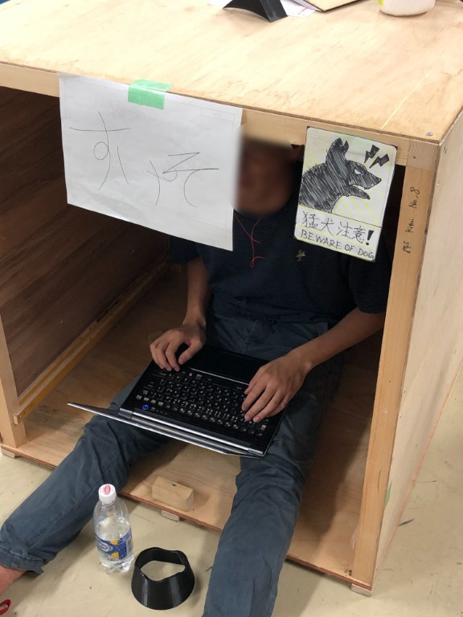

こんにちは，ずしです．

今回は箸休め的な記事です．

※この記事は若干のフィクションを含みますが，おおよそ事実です．

* * *

新歓といえば，大学のサークル等でありがちなのは多数の部員が集まって騒いでいる楽しそうにしている動画をよく見かけると思います．

ForteFibreでもそういうのを…と勝手に考えてみたところ，活動中の写真はヒトが写っているものが（というより写り込んでいるものですら）とても少なく，ロボットのものばかりであることに気が付きました．

そこで今回はロボコン界隈（主語が大きい）でも珍しい，ヒトがメインで写っている写真を公開していきます．

※その性質上，ほとんど活動外の写真です．

これらの写真は通称「フリ素」と呼ばれ，大変貴重（ほんまか）なものとなっております．

ForteFibreでのノリ，活動外でどんなことをしているのかを感じていただければ幸いです．

**注意：この記事で言う「フリ素」は，一般に言う「フリー素材」とは別の概念であり，フリー素材ではありません．**

* * *

ForteFibreに入ると普段の生活の中でも無意識に機構に吸い寄せられるようになります．

彼らは好奇心のまま動いた結果，自然とこのような状態になってしまうのです…

ForteFibreでの活動を通して得られる好奇心は日々の学習の原動力にもなるというわけです．

* * *

これは大会に向けてのアイデア出しの様子です．

* * *

部員それぞれに合わせた専用の作業環境が提供されることもあります．

* * *

部員で知恵を出し合ってPCを選びに行くときもあります．

* * *

ForteFibreに入部して楽しい学生生活を送りましょう！
