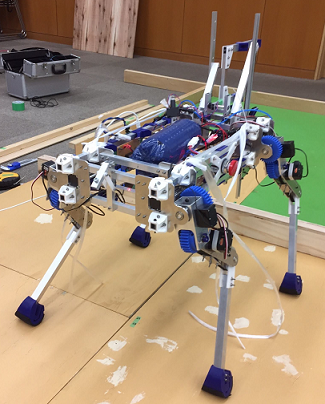

お久しぶりです．機械工学課程4年のプロです．約1年ぶりの投稿となります．  
新歓ブログということで今までの自分のことについて絡めながら，少しですが紹介をしていきます．

まずは入部以前のロボコン経験について．

自分の場合は入部するまでロボコン経験がないどころか，ほとんどPCを触ったことがありませんでした．  
そんな自分でも入部後には，先輩たちにいろいろと教えてもらったので今では1人でロボットを作ることができるようになっています．  
なのでロボコン経験やPCの使ったことがあるかどうかは気にせず，少しでも興味があれば気軽に来てもらえたらと思います．

また自分はハード班に所属しているので，3年間でやってきたことについて大まかに．

自分がハード班として入部したときは大体は

(1) 部内戦 \[6月\] → SRC2017 \[9月\] → 関西春ロボ2018 \[3月\] → とうロボ2018 or キャチロボ2018 \[9月\] → NHKロボコン2019 \[6月\]  
(2) 部内戦 \[6月\] → SRC2017 \[9月\] → NHKロボコン2018 \[6月\] → NHKロボコン2019 \[6月\]

のどちらかの流れで大会に出ることになってました．(\[ \]内は大会が行われる大体の月です)

自分の場合は，自分が出ていたSRC終わりに1つ上の先輩たちが出ていたとうロボを手伝ったとき，  
先輩たちと一緒にやるのが楽しかったので(2)の流れで大会に出ました．

これらの大会に出すロボットを設計する多くの場合，上部機構(ハンドなど)と足回りのように機構ごとに設計担当者を分け，  
各機構ができたらこれらをアセンブリしています．  
しかし，自分の代はハード班が計2人でした(少なくて悲しい...)  
そのため他の現2～4回生の人と違い，参加した3つの大会のうち2つの大会では自分1人でロボットを1台設計することをしていました．  

1人で設計ってしんどいと思われますが，逆に考えればロボットのすべてを自分で考えて作ることができることもあり，  
個人的には1人で設計するのも悪くないと思っています．

下の画像は1人で設計して作ったうちの1つであるNHKロボコン2019のときのロボットです．

- 
    

この4足歩行ロボットはカッコよくできたので個人的に気に入っています

これらのロボットを製作するためにも授業で学んだことが役に立ちます．  
それは，機械工学課程で主に学ぶ4力学(材料力学・熱力学・機械力学・流体力学)のうち材料力学と機械力学です．  
材料力学を学ぶことで，必要な剛性を満たしかつ軽量なものが作ることができるようになります．  
また機械力学を学ぶことによって，振動現象について考えることができるようになります．

授業でわからないところがあったりしても，プロジェクトには各学年7人ほど機械工学課程の人がいるはずなので，優しい先輩たちなら教えてくれます．  
(自分の場合は1つ上の現M1の先輩に強い人(mmm…)がいるので，今でもいろいろと教えてもらっています)

それではロボコンの紹介はこの辺で．ロボコンに興味がある人の入部を楽しみにしています．

ps. 機械工は毎学期しんどい授業が少なくても1～2個はあるから，単位はしっかりと取るんやぞ．
