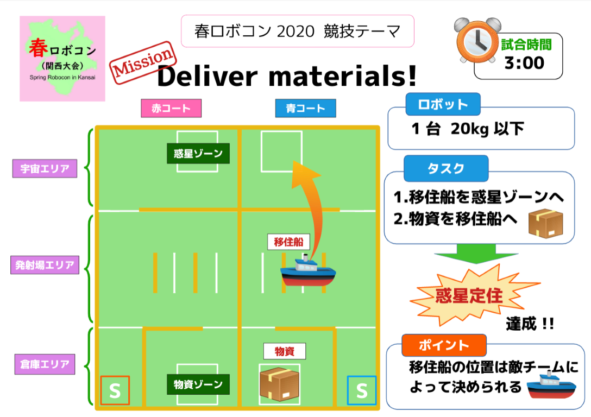

新型コロナウイルスによる自粛が続いていますが、皆さんいかがお過ごしでしょうか？  
  
お久しぶりです．かのーです．  
  
三密を避けるために家にずっと閉じこもっていますが、最近過ごしやすい気候になってきたようですね…　早く魚類に進化したい．  

閑話休題  
  
今回は残念ながら大会は中止になってしまいましたが，関西春ロボコンに向けて活動してきたことを軽く説明していきたいと思います．  

## 関西春ロボコンとは？

関西春ロボは技術の向上や新人の育成を目的として，大阪大学Robohanさん，同志社大学ロボット研究会さん，そして当プロジェクトによって開催されている大会です．今年はなんと関東春ロボコンと同じルールを使用し，関西春ロボコンの大会で上位のチームは，統一大会(関東春ロボコン)に招待される予定でした…．

## ルールについて

今年のルールは端的に伝えると，お手玉サイズのボールを移住船に見立てたケースに運ぶ競技です．  
  

[関西春ロボコンHP](https://xn--tck4d2b0a0029dol2bn0r.com/rule/)より引用

詳しいルールが気になった方は，[大会HP](https://xn--tck4d2b0a0029dol2bn0r.com/)で確認してください．

## team糸色走己について

本プロジェクトからは計2チーム春ロボに向けて活動していました．もう一つのチーム名はブログ公開まで楽しみにしておいてください．

私は糸色走己(ゼッキ)のチームリーダーとして約半年の間活動してきました．  
  
今回の大会に向けて作成したマシンは以下のような感じでした．

今回作成したマシン

ハード面では，物資を回収するハンドや船を回収する機構，物資を射出するための定荷重バネ砲を搭載していました．  
  
ソフト面では，春ロボコンに向け新たに開発した多数の基板を搭載していました．また，機体のインジゲータとしてフルカラーLEDを2本搭載し，さらに制御を安易にするためにレーザーモジュールを搭載していました．  
  
フルカラーLEDを搭載することで，以下のように自由自在に光らせることができます．ゲーミングロボットというあだ名が付きました  

実際にフルカラーLEDテープを使用するのは初の試みであった為，無事に運用できるか不安でしたが，制御担当が楽しそうに使用していたので良かったです．

ちなみに糸色走己は大会前に安定して惑星定住(Vゴール)を達成できていたこともあり，大会が中止になってしまったのは非常に残念な結果となってしまいました．  
しかし，今回の春ロボに向けて技術開発できたことは非常に有意義な結果となったと思います．ぜひとも今後の大会で生かして行きたいですね…

本来であればここに堂々と優勝しました！！！！！！と書きたかったんですけどね…  
  
大会結果が書けないので少しさみしいような気がしますが，今回はこの辺で説明を終わろうと思います．  
  
気になる点があればツイッターや任意の大会で聞いていただければ笑顔で説明したいと思いますので，その際はよろしくおねがいします．  
  
それでは皆さんご自愛下さいませ．　かのーがお送りいたしました．
