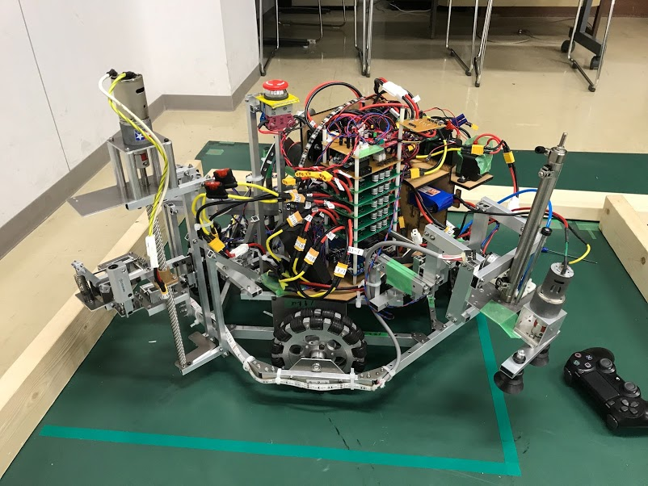
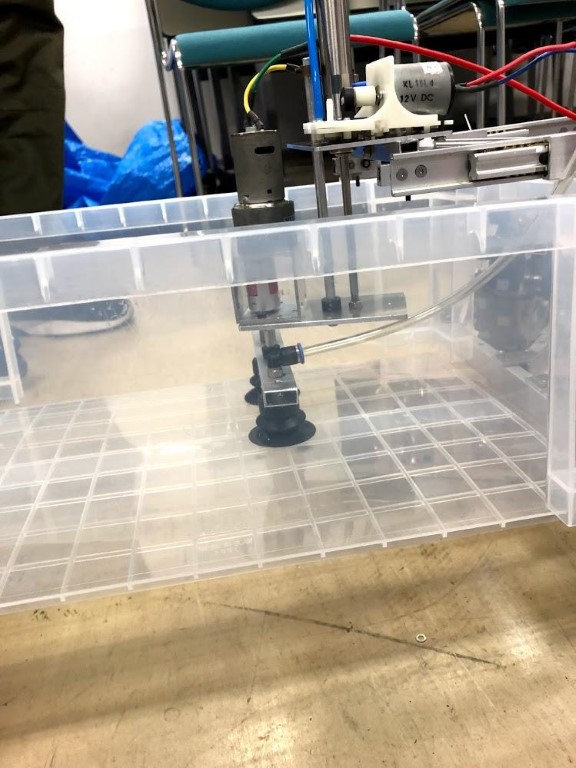
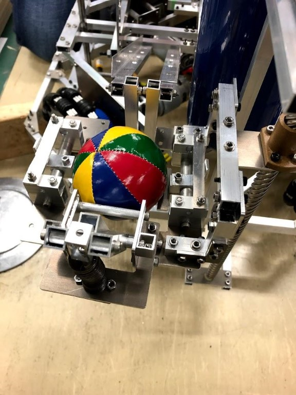
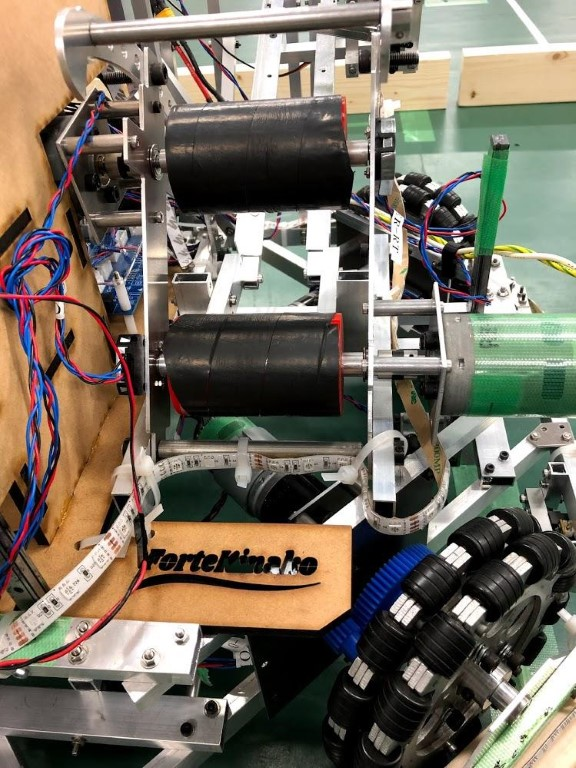
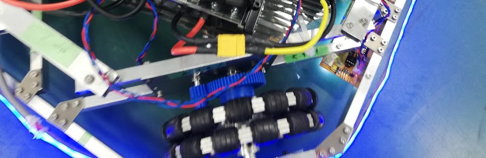

こんにちは、春ロボsKyWIperチーム2回生のフミです。

コロナが流行り、大学のオンライン授業が始まっても2回生になった実感が全くわきません。

本来僕たちは春ロボに出場するはずだったのですが、憎きコロナウイルスのせいで大会が消滅してしまいました。  
とはいえ、青春の8分の1をすべて注ぎ込んで作ったロボットを人目に触れさせずに終わらせてしまうのは残念なので、供養の意味も込めて色々と紹介していきたいと思います。

大会のルールについては昨日の糸色走己チームの紹介記事を確認してください。

まずチーム名について......

チーム名のsKyWIperの由来についてですが、史上最悪と言われるウイルスの別名からとっています。ちょうど春ロボの準備を始めたころにチームメンバーの一人のPCからウイルスが検出され、部のWiFiが強制停止を食らったというエピソードがもとになっています。  
ウイルス持ち込んだの誰だよ(僕ですごめんなさい......)

# 機体紹介

今回のルール上、機体の機構は大きく4つに分けられます。

- 移住船を保持するための機構
- 物資をフィールドから回収する機構
- 物資を射出する機構
- 足回り

機体の供養の意味を込めて、それぞれの機構を見ていきましょう。

## 移住船を保持する機構

移住船を吸引して持ち上げます。以上！  
ハード的には干渉がいろいろと起こって最後まで大変な機構でした。  

## 物資回収機構

モータ１つで物資の保持、持ち上げ、押出しまでを行える機構です。(担当者自慢ポイント)  
制作時には機構設計が2転、3転して不安な部分だったのですが、担当者が大会ぎりぎりまで試行錯誤してくれて、非常に素晴らしい出来の機構になりました。  

## 射出機構

2つの強力なローラで物資を射出します。  
ローラに巻くゴムの選定が非常に難しく、かなり苦労しました。  
ゴムの調達担当者はスポーツ専門店でテニスのグリップを連日買いあさり、不審な目でら見られていたそうです。  

## 足回り

一般的な4輪オムニです。  
「モータ滑らせてもエンコーダ滑らすな」の格言を守り、制御班からすると自己位置が正確に取れるので素晴らしい逸品でした。

## 基板置き場（番外編）

MDF製の基板置き場は、膨大な数の基板とバッテリーを収めることのできる設計になっていました。  
基板のメンテナンスの悪さとバッテリーの取り出しにくさ、バッテリーのおさまりの悪さ、基板タワーの高さを除くととても素晴らしい出来栄えでした()  
上面に彫られたソフトリーダとハードリーダの名前が担当者のイチ押しポイントです。

# ソフト班

ソフト班は、手動制御・自動制御・移住船機構制御・物資機構制御でプログラムを分担して作成しました。  
手動制御や上部機構は安定の挙動を見せたのですが、自動制御がぎりぎりまでバグ取りやパラメータ調整に追われて苦労しました。  
最終的に、一見暴走しているように見えて正確に動作する自動制御プログラムが完成してしまい、機体が音を立ててきしみながら爆走するようになったことは今となってはいい思い出です。(ホンマか)

大会で実際に使えなかったのは残念ですが、公開しても差し支えのないソフト的自慢ポイントをいくつかご紹介したいと思います。

## 自慢ポイントその１　ゲーミングロボット

なんと、機体がプログラマブルにフルカラーで光ります。  
  
高輝度LEDテープを使用しているので、真っ暗な部屋で光らせるときれいな光が部屋中を照らします。  
本番では機体の状態を表示するために使う予定でした。  
ゲーミングいいですよね、全男子の憧れだと思います。

## 自慢ポイントその２　正確な自己位置推定

フィールドの端から端まで機体が往復した際の自己位置推定の誤差は最大10mm!  
ハード班の優秀な機体とソフト班の明晰な頭脳の合わせ技です。  
大会でお披露目できなかったのが悔しい…

## 自慢ポイントその３　そびえたつ基板タワー()

この機体で実現したい動作をかなえてくれたわがままボディの基板タワーです。  
基板担当者が死んだような目をしながら連日実装してくれました。  
基板の総数は10枚！驚きの枚数です！

# 最後に

こんな感じでAチーム8人が半年分の青春、SAN値、単位を犠牲にして作ったロボットが完成したわけです。

ロボット自体は完成したものの大会に出られず悔しい思いもしましたが、ロボットを作る過程で色々なことを学び、チーム全員が大きく進歩できたので決して無駄な半年ではなかったと思います。

そうそう、書き忘れていましたがこの機体の名前は「forte Kinako(意訳：つおいきなこ)」です。ハードリーダーのきなこ君にちなんで名づけられました。

最後に、この素晴らしい機体を作ってくれたハードのみんな、コロナで思うように動けない中ギリギリまであきらめずに機体を制御してくれたソフトのみんなに感謝したいと思います。

本当にありがとうございました。  
forteKinakoに乾杯！
