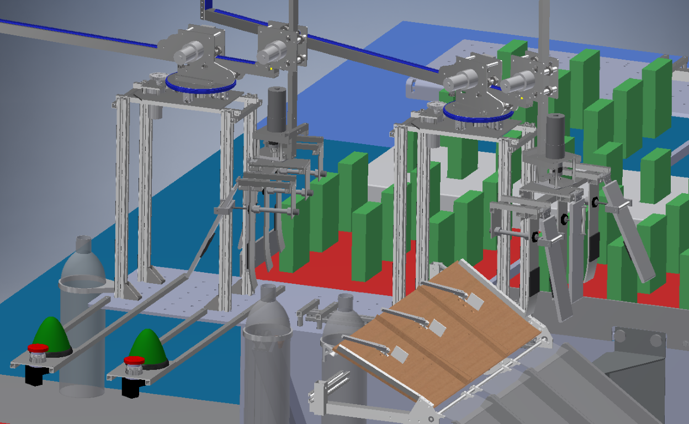
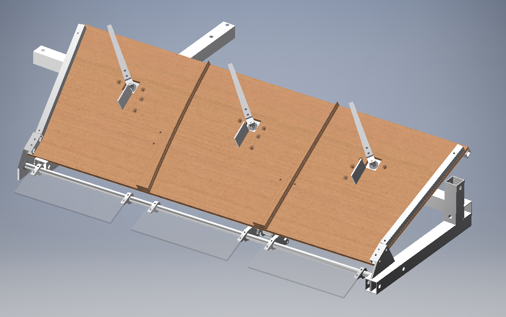

全国のロボット好きのみなさん、お疲れ様です。2回生ハード班のhachiです。  

僕たちのチーム　**ビューティフルでスマートな工繊生（ビスコ）**　がキャチロボ2020にエントリーしていました。

今回は、大会の正式名称が「キャチロボバトルコンテスト　第10回記念大会　-Ver.2020- **オンライン** キャチロボ！」だったことからもわかる通り、新型コロナウイルスの影響で**オンライン**での開催となりました。

###   
オンライン？

オンラインということで今年は実機を動かして対決するというようなことはありませんでした。  
その代わりに、第10回のテーマ「Catch the ビスコ！」にて、設計構想をもとに**プレゼン**での対決となりました。  
  
例年のように実機で対戦できたとしたらどんなロボットをどういう戦略で動かすのかというのがメインの内容になりました。  
今回は**YouTubeライブ**で観戦することができました。そのアーカイブが[こちら。](https://www.youtube.com/watch?v=DYl9Vo5bSDk)

###   
Catch the ビスコ！ のルール  

ルールを簡単にまとめると  
  
・競技は赤・青2チームの**対戦**形式で行われる  
・競技時間**3分間**でいかに多く得点できるかを競う  
・フィールドの**ワークをロボットでキャッチ**し、**シューティングBOXへ入れて**得点する  
・進入条件を満たすことで、**共通エリア**のワークを取りに行くことができる  
・ボーナス条件を満たすことで、**ボーナスポイント**を得ることができる  
  
となっています。

キャチロボは毎年お菓子（ワーク）を移動させる競技ですが、今年はビスコでした。

###   
チームビスコの結果

冒頭で「出場した」と言わずに「エントリーした」といっていることから薄々気づいている方もいらっしゃるかもしれませんが、一次審査で落ちてしまいました。

漠然と決勝まではいけると思っていたので現実の厳しさを実感しました。  
そして、決勝のプレゼンを見たとき、実力の差を感じ、もっと頑張ろうと思いました。  

###   
チームビスコが考えていた機体

チームビスコが1次審査の際CADで設計した機体を機構に分けて説明します。

全体

ハンド機構  

まずは、**ハンド機構**です。

ハンド機構には**エアシリンダ**と**バネ蝶番**を用いられており、挟み込むようにワークを掴んで移動させることができます。

固定用のアルミ板には**曲げ加工**を行い、かつバネ蝶番を用いた開閉機構を採用することで、位置的な**誤差を許容**できる設計になっています。

**ハンド全体が回転**できるようにモーターをつけることで、ハンドの向きがワークとシューティングBOXの両方の向きに対応できます。これによってより素早い条件達成が可能になります。

挟む部分に滑り止めのゴムを張ることでワークの把持を確実に行います。  

アーム機構

次に、**アーム機構**です。

モーターを3つ用いたアーム機構で**円筒座標上**でハンド機構を動かします。

土台にある円盤状のものでアーム全体のθ方向の回転を行います。土台の上についている**ラック＆ピニオン**をもちいた機構でr方向の長さが可変になっています。更にアームの先についている機構でハンドのz方向の高さを調節できます。以上の動きでワークに正確にアプローチをします。

r方向とz方向の動きをサポートするために、**ベアリングガイド**を搭載しています。

アピールポイントは、動きがわかりやすいので操作しやすいこと、設置面積が小さいので2つ設置できることです。

装填機構

最後に、**装填機構**です。

運ばれてきたワークを**シューティングボックス**に入れる役目を担っています。

各シューティングBOXに合わせ3分割されており、その中を更に2分割することで一度に6つのワーク(1段分)を保持できます。

ワークを装填機構の上部に置くことで**3つのワーク**を一度にまとめて装填します。この際装填機構上部にあるワイパーを装填機構の1区画いっぱいまで傾けることで**ガイド**の役割を果たし、滑り台の要領で滑らせつつ確実に装填することが可能です。

###   
最後に

今回、自分たちのチームは残念な結果で終わってしまったのですが、反省をし、今後の活動に生かしたいと思います。
