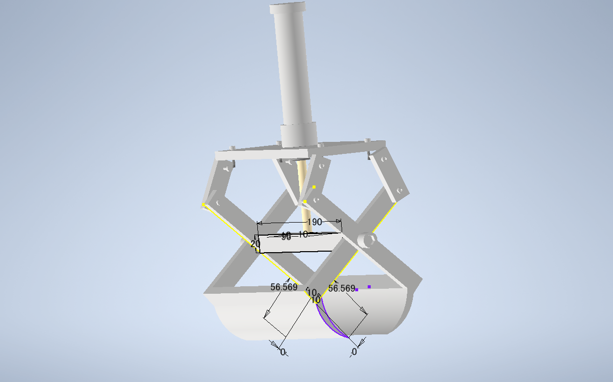
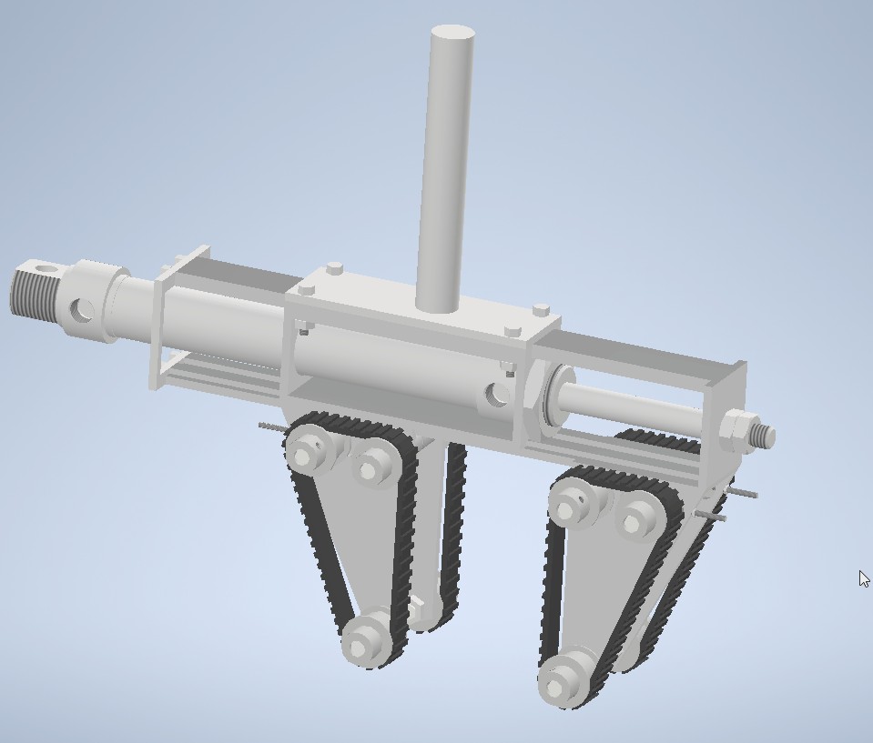

皆々様お久しぶりです。ひらめです。

本日はバレンタインですが皆様いかがお過ごしでしょうか。世にはチョコを餌に混ぜて育てた“チョコブリ”なるブリが存在するらしいですがチョコを多めに食べたヒトの身にも何か変質はあるのでしょうか。気になる。

閑話休題。今日の本題はハード班の新入生教育です。

昨年より始まった課外活動時間の制限を受け、我がプロジェクトチームも例に漏れず大幅に活動を制限されました。  
ろくな新入生歓迎もできずあわあわしておりましたが、それでもなおハード班には7人の新入生が入ってくれました。ありがたいことです。

活動制限や各新入生の入部時期のズレによって新入生教育も大きく変更することを余儀なくされました。  
例年はエアシリンダを用いたロボットハンドの設計を第一回、SRC or F3RCを第二回、関西春ロボを第三回新人戦とし、１年かけて新入生教育を行っていました。  
しかしながら今年のハード新入生教育はオンラインのみで完結することを余儀なくされた第一回新人戦(ロボットハンド製作)は実機製作は行わず、CAD作成のみとなりました。

課題を受けた新入生は登校禁止の中、マシンや機械要素、材料の現物を見たことがない状態での設計に苦労していましたが、過去の写真やmisumiのCADデータを活用してロボットハンドを設計してくれました。

まだまだ予断を許さない状況が続きますが、せっかく入ってくれた新入生には力の及ぶ限りロボコンさせてあげたいですね。

それではまたいずれ。
