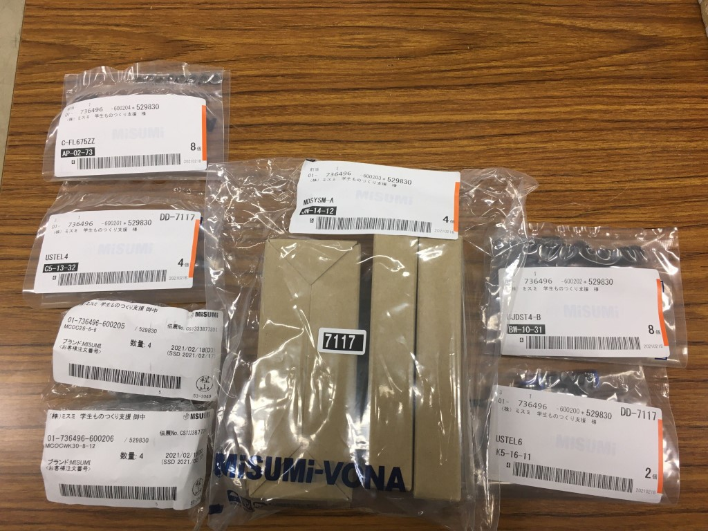

最近、準ブログ担当扱いのひらめです。気がついたら3月になっていました。寒暖差と花粉の辛い時期ですが皆様いかがお過ごしでしょうか。  
私はヒーターの前で身体を温めんとじっっとする毎日ですが、いくら空気と身体を温めても建物の熱容量の前には無力であることを痛感します。底冷えが辛い。

本日の本題は株式会社ミスミ様より“[学生ものづくり支援](https://www.misumi.co.jp/st-project/)”をいただいたことのご報告です。

ミスミ様による学生ものづくり支援は工学系のものづくりに挑戦する学生団体を対象に5万円分のミスミ製品を無償提供していただけるという非常に太っ腹な支援であります。  
しかも税抜で5万円分なので実質5万5千円分です。すごい。  
弊プロジェクトは確認できる限りでは2015年から毎年ご支援を頂いております。

今回の支援ではエアシリンダ等の制御に用いる電磁弁やカップリング(軸継手)など毎大会で一定数必要でありながらも、おいそれとは買えない程度に単価の高い部品の補充をさせていただきました。大切に使わせていただきます。

いただいた部品たち

本日はこれにて。それではまたいずれ。
