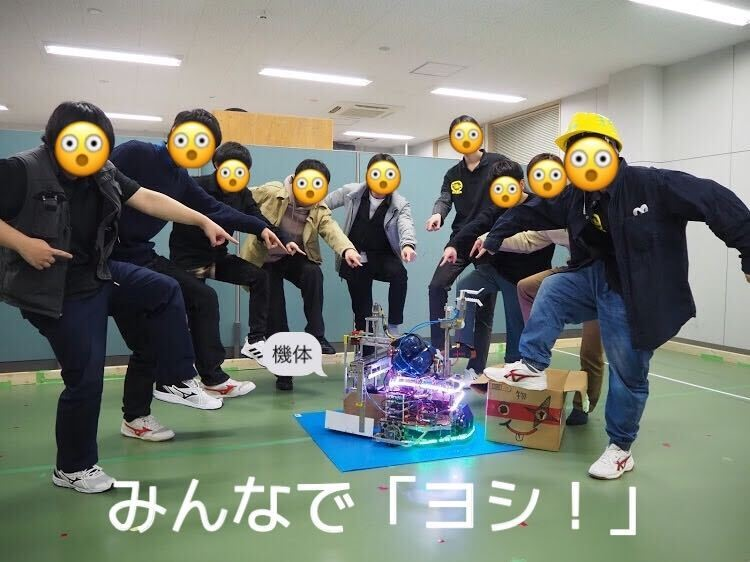
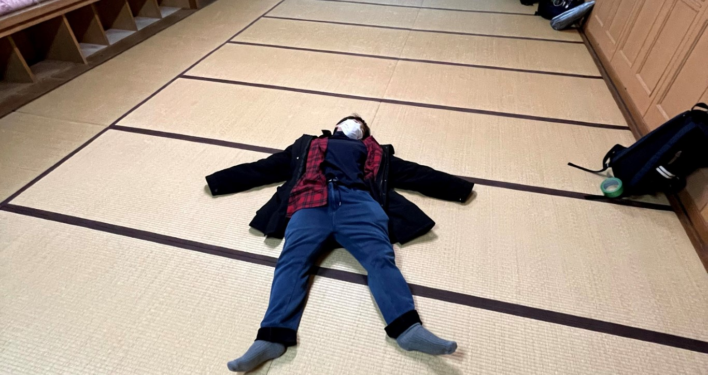

こんにちは。初めまして。一回生ハード班のろぼろふです。

実際のところもうそろそろ二回生なのですが、コロナのために学校にもあまり行けずロボコン活動も例年より大幅に活動できていないため、気持ち的にまだ一回生を抜け出せそうにないです。なのでこれからも一回生を名乗らせていただきます。

さて、ブログを書けと言われたので今回初めて書くことになったのですが、少々迷っているところがあります。思いっきりふざけるかそれともまじめにするか…しかし、今回は初めてということもあって緊張（笑）しているので普通に書こうと思います。

↑顔隠してるけどみんなこんな感じの顔してる

今回、私達は初めての大会として春ロボに参加してきました。この大会のお題は**「レジャーシートと弁当箱を運び、レジャーシートを敷いて弁当箱をその上に置き、乾杯する」**というもので、この一連の動作をロボットにさせ、タイムを競うものでした。人間がやったほうが速いやんというツッコミは置いておいて、初めて作るロボットがこんなにも様々な動作をするものだったのでいろいろな場面でたくさん躓きました。機体が完成する日を予定より一か月以上遅らせたり、発注したものが届かなかったり、ハード班とソフト班でうまく連携が取れなかったり、知識が全く足りていなかったり、オセロでぼろ負けしたり…

しかし、最終的に自分たちのロボットはちゃんと動くものに仕上がり、関西大会では優勝することができました。関東大会でも善戦したほうだと思います。（東大だけなんか違うかったもん…）ただ結果が良くとも悔しい部分が多かったことも事実です。もっとこうしていれば、ああしていれば。今になっていろいろ思うところがありますが、今回の経験を活かし、次につなげていこうと考えています。

ちなみに余談ですが、アイキャッチの画像は関西大会の際に泊まった部屋での写真で人数に対した部屋の広さに圧倒された私の画像です。四人でこの広い部屋を独占できたことが今大会で一番嬉しかったろぼろふでした。

↓アイキャッチの画像

