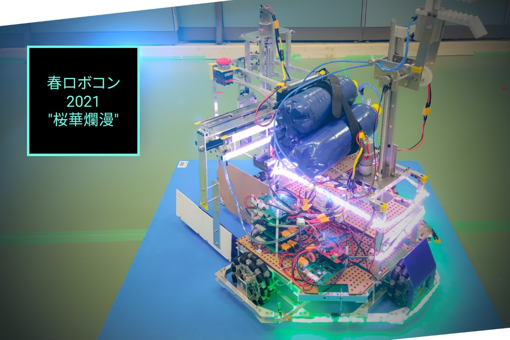

### ご挨拶

初めましての方は初めまして，そうでない方も初めまして．新2年，ソフト班-制御担当の蒼百合です．といっても，この記事の執筆中はまだ1年だったのですが．

さて，先の活動報告の通り，我々ForteFibre20一同は春ロボコン2021関西大会・関東大会に参加いたしました．

先の活動報告2件はともにハード班の者が担当しておりましたので，本記事ではソフト班-制御担当の視点から本年度，そして春ロボコン2021を振り返ります．

> 大会の次第につきましては，先の2名の活動報告および大会運営により公開されている動画をご覧ください．([関西大会](https://youtu.be/__SM6BA3woo), [関東大会](https://youtu.be/6nMzfjwEu7k))

### キャパオーバー

弊プロジェクトでは例年ソフト班を回路担当，制御担当に分けているのですが，本年度はCOVID-19の影響で新入生が非常に少なく，1年の制御担当は私1名となっていました．  
春学期，秋学期ともに学業が多忙を極める中，制御の練習は殆どできなかったと言っても過言ではないでしょう． いくつかの新入生教育を受けた覚えはありますが，当時はそれらを吸収できる余裕などなく，そして当然ながらその後の部内新人戦に割くそれもありませんでした． 12月頃からなんとか動きだしたものの殆ど活動できず，結局のところ練習用機体を使って制御練習をしていたのは春季休業期間に入った2月中旬から下旬までの2週間程度だったと記憶しています．

プログラミング未経験の私にとって，これはとんでもないことです．この2週間，事前の活動も含めれば4週間程度でしょうか，その間に新しい環境，システム，制御などについての知識を蓄えました．全て本大会をサポート下さった3年の先輩の丁寧な指導あってのことで，本当に頭が上がりません．

### 意外と…

さて，そうは言ったものの，COVID-19による新人教育の遅れを考慮して，例年より簡単な競技内容になっていたこともあり，機体の制御はさほど難しいものではありませんでした．

とはいえ，3月1日に本番機体の制御を書き始めて，4日の機体完成直後にはVゴールの動画を撮影できているのですから，我ながらよくやったものです．

> 今から考えればできて当然ではあるのですが．

### 最難関

本大会における最難関は実は制御ではなく操縦でした． ハードウェアトラブルによって低精度の手動制御を余儀なくされたのですが，これが問題でした．

> 製品に対する理解不足によるものでした．

手動制御ということは人間がコントローラで操縦する必要があるということなのですが，本大会においては機体制御の全てを私が書いていましたので，操作を最も理解している私が操縦者ということになりました． しかし私はPC以外でゲームをしたことがなく，所謂"コントローラ"で何かを操作するということが初めてでしたので，この感覚をつかむのが大変でした．

> 私のラップトップをコントローラとして計上していたので，審判が許せば使い慣れているキー操作(WASD操作)を採用しても良かったかもしれません．

加えて我々の機体は大型でしたので，低精度の手動制御で狭い花見客を避けていくのは至難の業でした． そのため，練習時間が足りなかった関西大会では速度を抑えていました．その後も関東大会までに練習時間がとれず，速度を抑えた状態で挑むつもりだったのですが，どうせなら，と指が反応できる限界まで速度を上げました．おかげでベストタイムを関西大会時の90秒から関東大会時には50秒まで短縮することができましたが，その分操作ミスが増えないよう極限まで集中していました．

> 関東大会では全試合でVゴールを達成できたので，安堵しています．

因みに，時折機体が赤く点灯して停止していたのは実証段階の技術の不安定さによるものです．

### 総評

本年度はCOVID-19の影響でハード，ソフトともに技術教育を十分に身に付けることができず，大会で無理矢理実戦慣れしたように感じます．それで乗り切れたので良かったのですが，次はもう少し効率よく動きたいところです．

> ご安全に！

さて，先日東海地区交流ロボコン(とうロボ)のルールが発表され，ForteFibre20メンバ一同は早速動き出しております．次は万全の状態で勝つつもりですので，その頃にまたお会いしましょう，それでは．

### 補記

#### ~この記事を読まれている新入生の方へ~

筆者は弊プロジェクト加入時点でロボコンはおろかプログラミングすら未経験でしたが，それでも戦力になれています．ですので，「やってみたいけれど，自分にできるだろうか」と臆病になっているならまずは参加してみてください．やる気があればやってやれないことはありません．その途上でもし躓いても，必ず我々やその上の先輩方が助けになることでしょう．

> 部員が欲しいのです，どうか，どうか．

次は部室で会えることを楽しみにしています．
