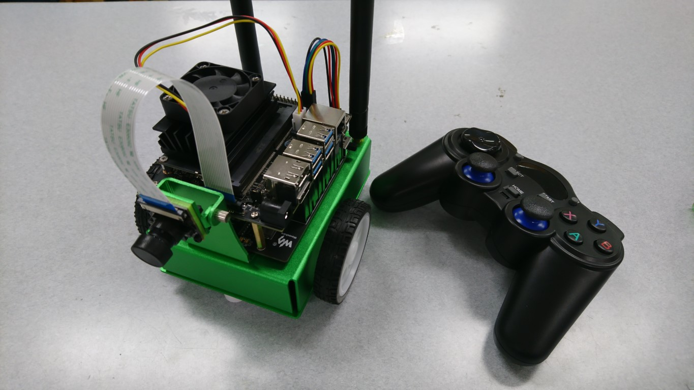

こんにちは。春ロボコン2021でソフト班として機体の制御を担当した、ゆゆです。

春ロボコン2021の全体的な様子や、ハード班やソフト班視点での活動については、メンバーがいくつか記事を書いてくれているので、そちらも合わせて読んでもらえると嬉しいです！

[春ロボ2021の活動記録](https://www.fortefibre.net/blog/?p=4425)  
[春ロボ2021ハード班活動記録](https://www.fortefibre.net/blog/?p=4457)  
[春ロボコン2021雑記](https://www.fortefibre.net/blog/?p=4453)

タイトルにもある通り、僕たちのチーム「新入社員」は関西春ロボコン2021において優勝し、大会のスポンサーである一志株式会社様より特別賞をいただきました。  
初めての大会でこのような良い結果を残すことができ、とても嬉しく思っています。

特別賞の内容としては、「Jetson Nano + JetBot AI Kit」です。早速組み立てて写真を撮ってみました！

JetBotと付属のコントローラ

取り付けられたカメラを用いて、AIによる物体認識や経路計画を行うチュートリアルが用意されているようなので、これから沢山遊んでみたいと思います！

また、Jetson Nanoに搭載されているGPUを用いてGPGPUの技術やCUDAを触りだすメンバーが出てくるかもしれませんね。  
次の大会までに、どれだけ成長できるか楽しみです！

改めまして、大会の準備や進行をしてくれた運営の方々、ご協力いただいたスポンサー企業様、ありがとうございました。とても楽しかったです！
