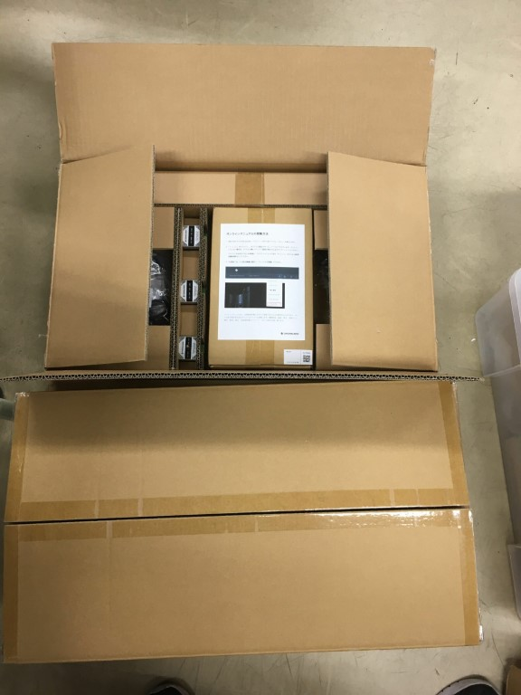
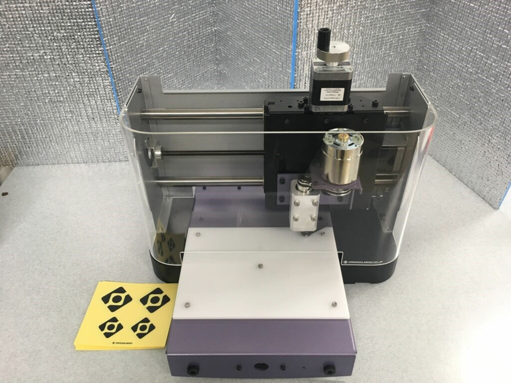

おひさしぶりです。ハードリーダーのひらめです。

去る5月に株式会社オリジナルマインド様が実施されていた[加工機抽選寄贈キャンペーン](https://www.originalmind.co.jp/donation/)(応募期間終了)を皆様はご存知でしょうか？

[株式会社オリジナルマインド様](https://www.originalmind.co.jp/)は卓上CNCフライスなどで有名な企業です。魅力的な製品が多く、メイカーやロボコニストでは知らない人はいないであろうという感じがします。かくいう我々ForteFibreも卓上CNCフライスSR200をはじめとしてオリジナルマインド製品を愛用しております。

そのオリジナルマインド様が学校関係者・団体を対象に無償で加工機を抽選寄贈してくださるというたいへんに太っ腹なキャンペーンがあったのです。

さて本日の本題です。

**抽選寄贈に当選いたしました！！！**　うれしい！！当たると思ってなかった！！！！

寄贈していただけるのは基板加工機です。そしてこちらが頂いた基板加工機CIP100です。

CIP100

先週末に早速組み立てました。

CIP100!!

これから大切に、されどしっかりと使わせていただきます。

本当にありがとうございました。頂いたご支援にForteFibreを代表して心から感謝申し上げます。
