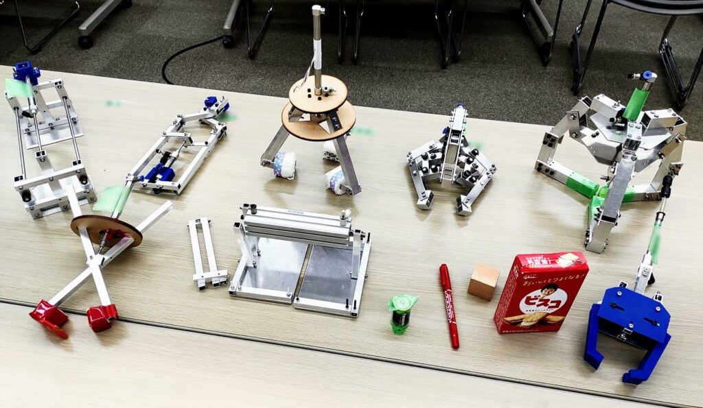

はじめまして、一回生ハード班のたぬきです。

先日、新入生にとって最初の晴れ舞台である　 **第一回新人戦** が行われました。  
ハード班新入生への課題はロボットハンド製作です。

ビスコ(箱)・積み木・マッキー(細)・単2電池 といった様々な形状・重量の対象ワークを掴むことを目標とし、把持性能(しっかり持てているかどうか)・加工精度・デザイン性・の3項目で評価がなされ、その総合点で競いました。

「総合点上位者には景品あるらしいで！？」と小耳に挟んだ我々一同は、最後までやる気にみちみちて取り組むことができました。

新入生にとって、設計ソフトであるCADの使い方や加工機械の使い方などを学ぶ機会となったミニチュア（スマホスタンドや小物テーブル）の製作に続いて、初めて自分のアイデアを形に仕上げることに取り組む第一回新人戦。  
どのようなハンドが作りたいか考える “アイデア出し” から 実機製作 までの一通りの流れを経験するのは初めてでしたが、各々楽しんで取り組めていたと思います。

複雑にすると作るのが難しいとわかりつつもロマンを追い求める者(ドM)や、ハンドを可愛くデコる(死語)おちゃめな女子部員もいたりなど、それぞれ様々なこだわりのポイントを持って自作ハンドへの愛着を育てながら製作していきました。他の人のハンドが徐々に完成に近づいていく様子に刺激を受けながらも、新入生同士仲よく、先輩も優しくアドバイスしてくださり、とても雰囲気のいい作業場でした。

第一回新人戦では、1本のエアシリンダーによる動力だけで様々な形状の物体を掴まなければいけませんでした。その動力の使い方にも、掴む・挟む・すくいあげるなど、多様の仕組みが考えられます。そういった基本的なところから自分達で設計し、加工した機体が実際に動くところを見ることができ大会は非常に盛り上がりました。  
今年度の新人戦では全員がロボットハンドを完成させることができ、不戦敗となる人がいませんでした！（例年、数人は完成させられないものらしい）素晴らしい！！！

コロナ禍による活動時間の制限の影響もあり、私を筆頭に 時間に追われていた人が多かったように思います。ともに苦しんだ同士との間にはアツい友情が育まれました。  
そう皆さん、これが青春ってやつです。  
そんなこんなで頑張って作った機体は、やっぱり最高にかわいくてかっこいい！！愛着がとまりません。ものづくり、楽しい！

現在、新入生は各自新人戦の反省点をまとめ終え、すでに次の大会へと取り組み始めています。次の大会に向けては数人のチームを組んでおり、第一回の個人戦とは一味違った、チームならではの楽しさと難しさを学んでいる最中です。初の外部大会で優秀な成績をのこしたい！と勇む様子はお互いに良い刺激となっています。  
それではまた。
