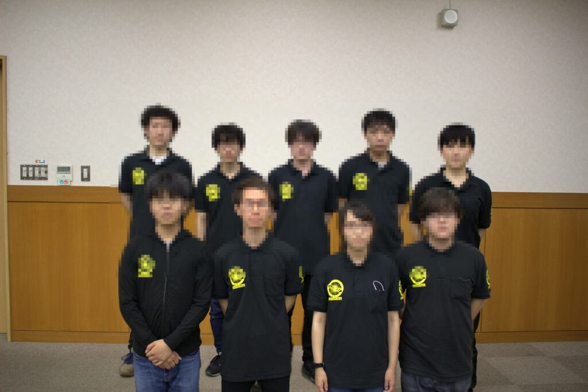

京都はだいぶ涼しくなってきて，8月であることを疑いながら日々を過ごしております．  
お久しぶりです，りーだるです．

ブログでの報告が大変遅くなってしまい申し訳ありません．  
Twitterではすでにご報告させていただいておりますが，出場のための最終関門である2次ビデオ審査に合格し，  
NHK学生ロボコン2021への出場が決定しましたことをここにご報告いたします．

弊プロジェクトとしては2019年の大会から2年ぶり，12回目の出場となります．  

今年の2次ビデオ審査は5日間あるテスト期間の3日目が締め切りだったのですが，  
前日まで動画素材を撮影し，当日朝まで資料を直し…といつにもまして慌ただしい2次ビ前でした．  
動画を編集してくれた先輩には感謝しきれません…(;''∀'')  
(動画編集以外の2次ビ資料回りの殆どを担っていた僕はテスト期間完全に発狂してました)

新型コロナウイルス感染症が現在も猛威を振るっており，我々も常日頃から1人1人が感染しないように様々な対策を講じながら活動を続けているわけですが，  
今年は無観客といえども現地で大会が開催されるのことで(2021/08/21時点)  
2次ビ通過とあいまってほっとした気持ちでいっぱいというのが正直なところです．

もちろんNHK学生ロボコンの出場が決まったことは本戦のスタートラインに立てたというだけで，あくまで通過点でしかありません．

今年こそは我らがROBOCON挑戦プロジェクト初の決勝トーナメント勝利を飾れるように  
あと2週間少々，メンバー一同必死で活動に取り組んでまいります．

おそらく配信はされると思うので，今年はぜひパソコンやスマホの前で応援よろしくお願い致します！

