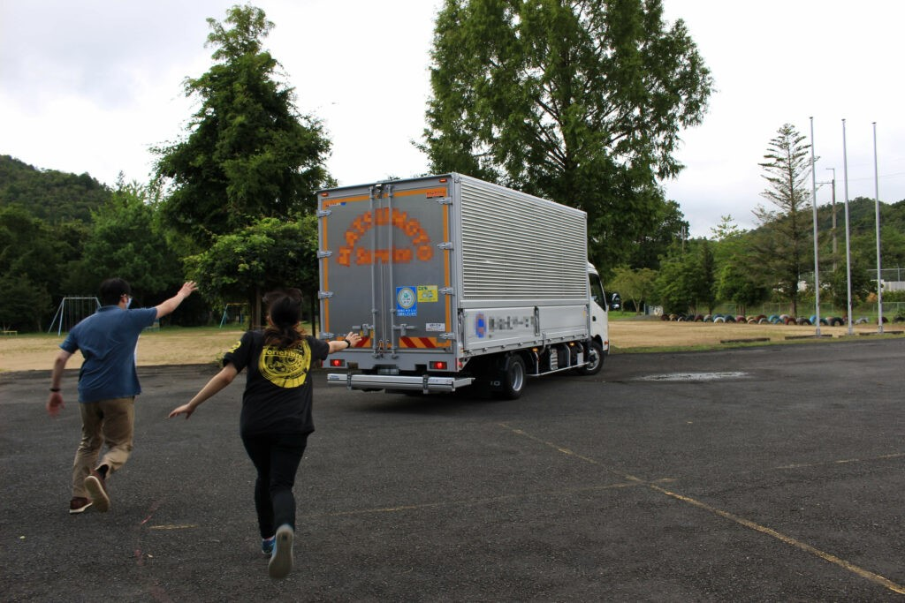

こんにちは  
2日連続のブログ更新となります，りーだるです．

2021年8月19日,20日の2日間，関西春ロボコン運営委員会が主催する関西合同練習試合に参加してきました．

のどかな田園風景を眺めながらやってきた，あかまつの丘　西本梅．  
ここにNHK学生ロボコンに出場が決定した近畿地区の4大学が集まり，NHK学生ロボコンのルールに則って本番に近づけた環境でテストランや試合を行いました．

  
主催の多くは各大学の学ロボOBなので本番環境や経験談など様々な話を聞き，時には注意を受けながら…  
本番を意識しつつロボコンの事だけを考えた2日間となりました．

また大会前ではありますが，他大の機体や戦略を見るだけでなく各自交流を深めることもでき，  
自分たちの未熟さや修正すべき点，大会において問題が発生した時にどうすべきかといった  
当日及びこの2週間でやらなくてはならないことも明確になったように思います．

特に僕らの代はコロナの影響で対外試合の経験が少ないので，メンバー全員にとって学ぶことの多い充実した時間であったはずです．

得られたことを確実に咀嚼し，修正や調整・準備を重ねていくことで  
この2日間が本当に有意義であったことを大会当日に証明できればと思います．

今回参加した4チームすべてが本大会でいい結果を残せることを期待して…  
まずは僕らがその先陣を切れるよう，勝ち進んでいく所存です．

トラックを追いかける人たち

p.s.

写真は試合会場から大学に向かう機体を載せたトラックを追いかけるチームリーダーとOBです．  
心優しいトラック運転手さんは何か忘れたのかと思って止まってくれました…  
この場をお借りして…  
本当にごめんなさい(.\_.)
