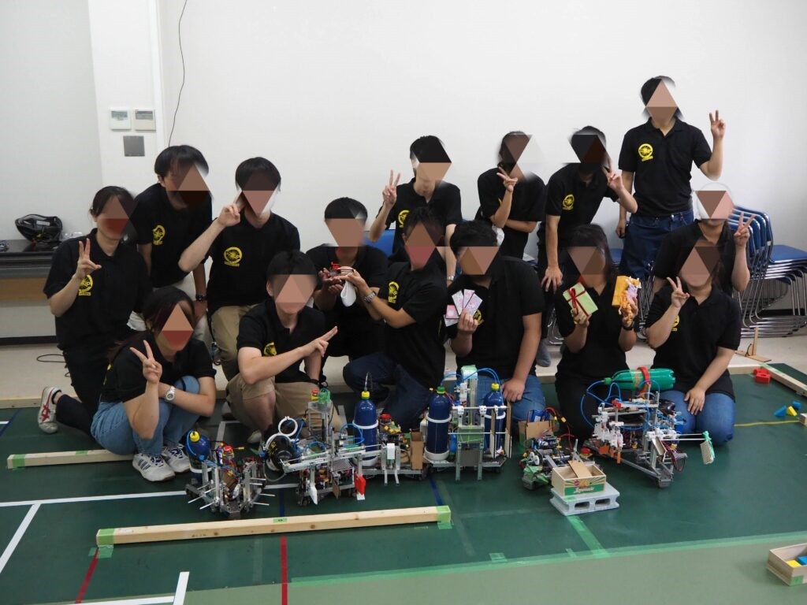

　こんにちは。1回ハードのウトウです。私たちff21生は金沢工業大学主催の大会であるSRC2021に参加しました。ForteFibreに入部して2回目の大会ではありましたが、初めてのチーム戦として第一回新人戦の時には経験できなかった様々な課題に直面しました。今回はオンライン開催と言うこともあって実際の試合の雰囲気などつかみにくいことも多かったのですが、その中で学べたことについてまとめていきます

## 初めてのチーム戦

　第一回新人戦との決定的な違いはチーム戦だったことだと思います。私はハード班なのでハード目線になりますが、今まではアイデア出し、機構決定、加工と組み立てをすべて自分で行っていましたが、今回はそれらをチームの仕事として行い、加えてソフトの制御のことも考えなくてはいけなくなりました。

　加工と組み立てについてですが、ここはチームとしての難しさが顕著に表れていたのではないかと思います。SRCの加工や組み立てはほとんど夏休み期間中に行われており、予定が入っていて忙しい人がいる一方、ほとんど毎日部活に来れる人もいたため、どうしても用事が入っている人のタスク量が減ってしまい、高頻度で部室に来ている人たちにとっては少しストレスになったのかなと思います。用事があって部活に来れないのは当然のことだし、誰もが部活を最優先に考えているわけでもないため、タスクに差が生まれるのは仕方のないことだと思います。そういった事情を鑑みてタスクを振り分けることが大切だと思いました。

　ハードとソフトのすり合わせについても難しさを感じました。といっても今回のSRC2021は全体的にハード班がソフトに迷惑をかける形になってしまいました。正直ほとんどのチームが大会前日や前々日ぐらいにやっと機体ができた状態で、ソフトの皆さんにはどうやって制御すんねん！という思いをさせてしまったんじゃないでしょうか。かろうじて足回りは少し早く上がっていたことと、上部機構はエアシリンダーが多く使われていたため、制御が少し楽(知らんけど)だったので、ギリギリ間に合っていた(?)感じでした。本当にソフトの皆さんには申し訳ない気持ちでいっぱいです。また、今回は基板やリポ、ペットボトル、緊停など機構以外にも様々なものが機体に乗ったため、割と多くの人がそのことを忘れて設計をしており、そういったものを何とか半分やけくそみたいな感じでつけたチームもありました。

## 大会当日

　大会当日は私たちの想像をはるかに超えるあわただしさでした。一部大会に必要な部品を忘れてしまったり、普段は正しく動くはずの機体がなぜかうまく動かなかったりとパニックの連続でした。

　本番はオンライン開催ということもあり、あっという間に終わってしまった印象でした。3チーム出場しましたが、全チーム初戦敗退という残念な結果に終わってしまいました。本来の実力を出し切ったチーム、出し切れなかったチームがあったと思います。今大会で痛感したのはやはり相手校との実力の差だったのではないでしょうか。交流会ではいろいろな機構を教えていただき、学ぶことが多いと感じることに加えて、ただ自分で考えて設計をするだけでなく自分でしっかり調べてどういった機械要素、機構があるのか知ったうえで設計を行うことでもっと良い機体を生み出していけるのではないかということに気づけました。

## SRCを終えての反省＆校内戦、春ロボに向けて

　そして、次は春ロボです。春ロボはおそらく2チームに分けられます(多分)。今回よりもメンバー、タスクがともに増えることでさらなる問題が出てくると思います。そうなったときに今回の反省が生かせればいいですね。皆さん本当にお疲れ様でした!!
