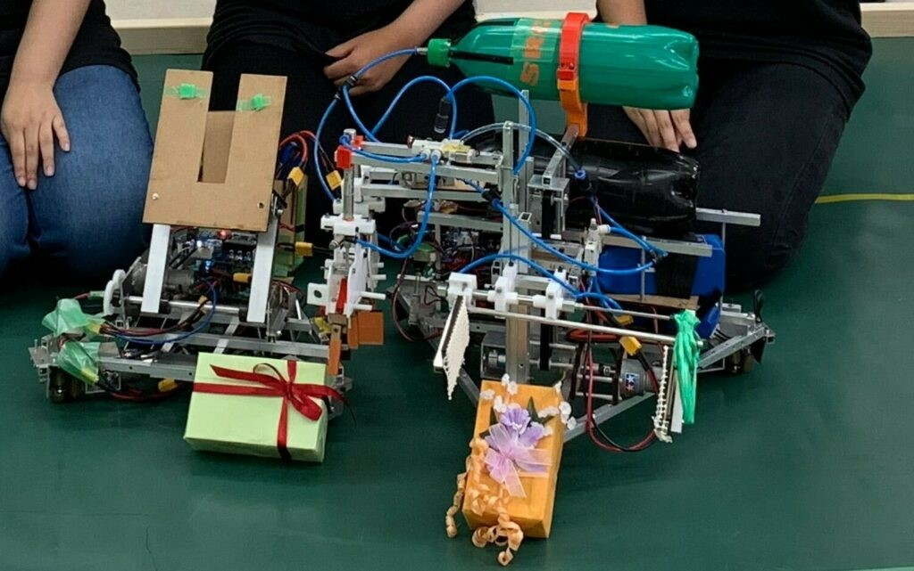

　初めまして、1回生ハード班のかぶです。先日、SRCという新入生初となる外部大会に出場させて頂きました。新入生を3つのチームに分け、1チームハード班3人、ソフト班2人の5人1チームで大会に臨みました。ちなみに僕のチームの名前は5 spindles。由来は…忘れました(笑)

　この大会の詳しいルール説明は省略しますが、簡単に言うと、目的の物をアームで掴んで、目的地へ運搬！を繰り返す感じです。機体は、ボタンを押すとプログラムされた経路を走る自動機と、PSコントローラーで操作する手動機の2機を使います。第1回新人戦で培った設計や加工の技術を基に、さらなる技術の向上を目指しながら新入生全員が意気揚々と大会に向けて動きました。

　1本のアームで複数の仕事を確実にこなす機体を作るチームや、複数のアームで時短を目指すチームなど様々でしたが、僕達のチームはロマンを追いかけて、無駄に製作が難しい機体を作ることになってしまいました。チームメンバーの活動時間の加減やその難しさ故に徐々に遅れをきたしてしまい…。それに拍車をかけるように大会の日程の前倒し！僕達ハード班が機体を完成させたのは大会の数日前…。ソフト班の人にはとても申し訳ない限りでした。大会ギリギリまで調整を続けなんとか形になりました。

　ちなみに僕達のチームの自動機は、ワークを掴んでいたアームをモーターの力を使うことによって下ろし、そのまま機体を後ろに退くことで目的の場所にワークを置く仕組みです。手動機は、エアシリンダーを用いることでアームを開閉させ、ワークを掴み、運搬し、配置する仕組みになっています。

(自動機：左)(手動機：右)

迎えた大会当日、みんな不安も抱えながらもどこかで期待を抱いていた様子。しかし結果は、初戦で惨敗。とても悔しい結果となってしまいました。他のチームも善戦はしたものの初戦敗退。全員が悔しさを感じていたところに、先輩から日を改めての部内戦の提案が！すぐさまみんながそれに食らいつき、機体の機能改善・向上に努めました。部内戦でも優勝できなかったものの、大会の時よりも良い成績が残せてみんな少し満足げ。少し後悔が残っていたのも事実ですが…。

　そんなこんなで無事終了した今回の大会。次の春ロボに向けて、新たなチームに分かれ、今まさに動きだそうとしているところです！
