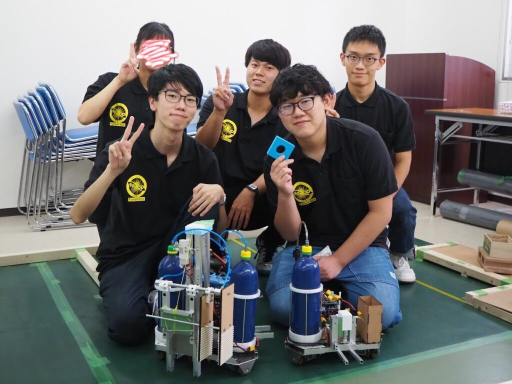

左が手動機・右が自動機

> 自動機：エンコーダーで位置を把握して自動で動く機体なので、足回りの精度にこだわりました。大会本番まで一度も不具合を起こさない安定した設計でした。
> 
> 手動機：オブジェクトを挟んでつかむというシンプルな作りにしました。トラスで強度を出すなど細かい調整に力を入れました。

こんにちは、一回生ハード班のとまとです。この夏、私たち新入生は初めての部外大会・SRCに参加してきました。

今回が初めての部外大会ということもあって、思うようにいかないこともたくさんありました。自動機・手動機がサイズ制限をオーバーしていることが完成後に判明したり、完成した手動機が全然思うような動きをしなかったり...

手動機ははじめの設計から大きく異なるものになってしまいましたが、自動機・手動機どちらも不具合を担当者が寝不足になりながら修正し、なんとか、大会に出場出来ました！

大会本番では、初戦敗退してしまいましたが、直前でのルール変更にも冷静に対応できて、自分的には満足な戦いができました。

しかし、手動機操縦・制御担当者はVゴールを達成できなかったことがすごく悔しかったらしく、大会後も操縦練習...

大会後に、全チーム初戦敗退したことを気遣って先輩方が企画してくれた部内戦では見事Vゴールを達成して優勝！操縦・制御担当者も不完全燃焼感を解消し、満足な結果となりました。

最後になりますが、ほとんど全ての会議に出席してアドバイスをくれたアドバイザーの方々、遅くまで加工に付き合ってくれた先輩方や工場の技師さん、大会の会場を手配しフィールドを設営や審判をしてくれた先輩方、部内戦を企画してくれた先輩方、本当にありがとうございました。チームでロボットを作り、それが動く楽しさや達成感を味わえました！！
