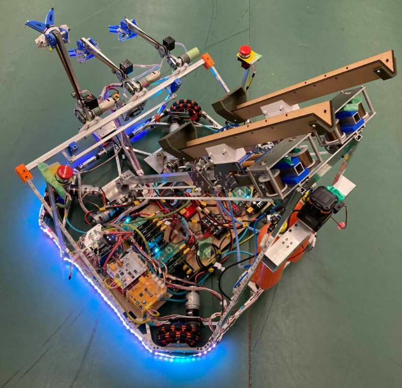
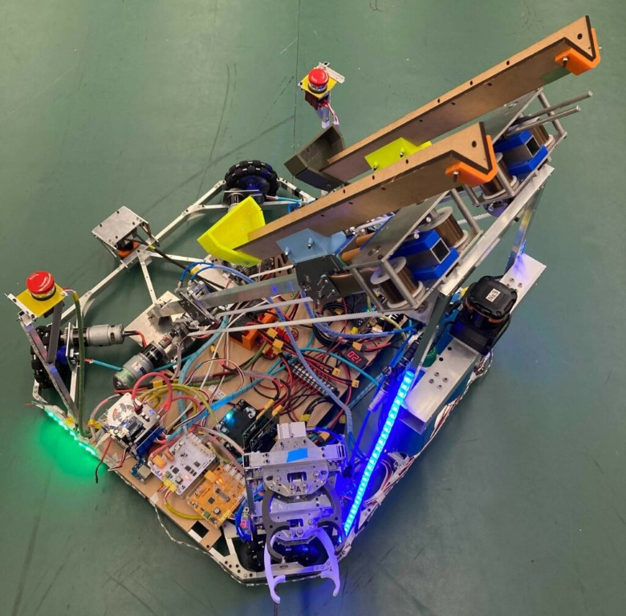
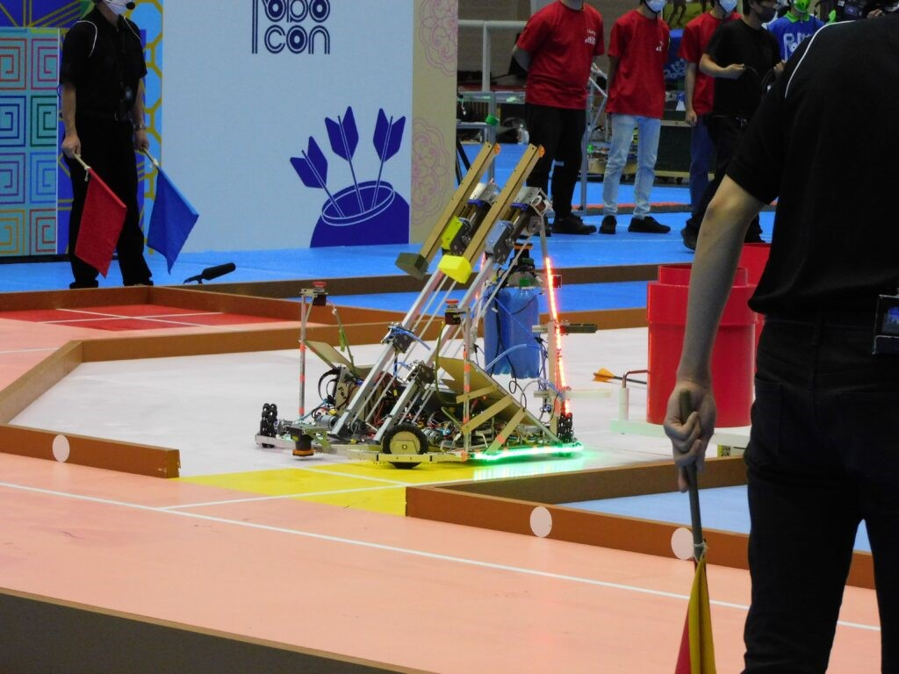
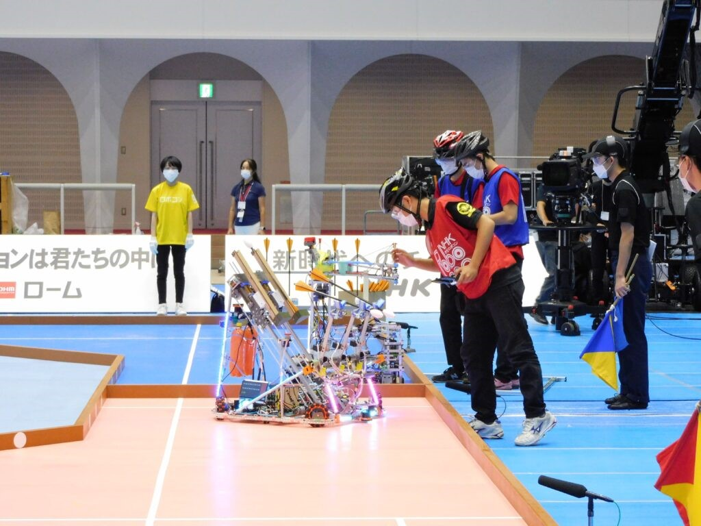

季節は冬，

気づけば12月となり2021年がそろそろ終わりそうな気配が漂ってまいりました．嘘だろ…？

お久しぶりです，りーだるです．

みなさんご存じの事とは思いますが，  
我々ForteFibreは10月10日に行われたNHK学生ロボコン2021に出場してきました！  
既に丸2か月経っております．なんなら先週本放送も終了しました．  
報告が遅くなり大変申し訳ありませんでした．(完全に現実から目を背けていました)

## 結果報告

まずは簡単に結果の報告だけ．  
ForteFibreは2次ビデオ審査においてシードをいただき，予選リーグAブロックで金沢工業大学さんと早稲田大学さんと対戦しました．  
第1試合 vs金沢工業大学  
0-2 で敗北

第2試合 vs早稲田大学  
0-1 で敗北

2敗で予選リーグ敗退となりました．

TRの自己位置推定が正常に作動していなかったこと，また練習に使っていたアローラックと実際のアローラックとの摩擦が異なり，矢の回収機構がうまく機能しなかったこと  
更には2機体共に大会環境におけるコントローラの通信環境が不安定であったことなど様々な問題が表出し，機体が思うように動かせませんでした．

  
シードを頂いていたにもかかわらず，得点はおろか機体が動く姿も殆どお見せできない，多くの課題が浮き彫りとなる不甲斐ない結果となりました．

DR操縦者としては特に2戦目，3型ポットに放った矢を入れてさえいれば…と2か月たった今もずっと引きずっております…(成仏できそうにないです)  

ちなみに12/5に放送された本放送には一瞬映してもらえたとかもらえていないとか…．  
まだ明日夕方くらいまでならNHKplusでみられるらしいので，  
NHK契約していて未視聴の方はぜひご覧ください！  
見逃した方はYoutubeにまだ残っている学ロボ2021アーカイブをぜひご覧いただければと思います．  
[https://youtu.be/jSL5CWUH6a0](https://youtu.be/jSL5CWUH6a0)  
僕もそろそろ現実と向き合って，推し機体を放送内で見たいと思います('ω')

### 懐古と小噺

これはおそらく多かれ少なかれほとんどのチームが抱えていた問題だと思いますが，実は2020年11月末まで活動が完全に止められていました．  
  
活動停止期間は部室に集まることはできませんでしたが，近くの大きめの公園にメンバーが"たまたま集合して"ヒト投壺をして遊んでいました．  
普段外にほとんど出ないメンバーたちも多く，健康にも良い活動でした(小並感)  

この記事を書くにあたって8月の2次ビ通過のブログを見ていたのですが，当時はまだ9月開催を予定していたんだったなぁ…とちょっと懐かしくなりました．  
(ブログ公開後すぐ大会延期が通達されて絶望してたのはまた別の話)  
  
本大会，当初は5月開催予定で9月10月と2度の延期をしての開催となっています．  
5月開催時は何とかなっていたと思われますが，実は9月時点で大会が開催されていたら2機体での出場ができていたかかなり怪しい状態でした．  
加工時間も制限がかかった中で出場機体をきちんと作ることが出来たのは，最低限のハードルではあるものの本当に良かったです．

  
2度の延期を乗り越え様々な制限がありながらも現地で開催し，1年かけて製作してきた機体を皆様にできたこと，とてもほっとしています．  
大会開催のためにご尽力くださった様々な皆さんに本当に感謝しております，ありがとうございました．

## 機体紹介

### TR

こちらがTRです(  
お名前はTipということになっています  
チップじゃなくてティップです(こだわり)

TR大会出場ver

ぴかぴか光るLEDが特徴的なゲーミング機体です．  
きっと来年はどこも機体を光らせてくることでしょう(違う)

光らせていたのは目を引きたかったからとかではなく，純粋に状態表示を目的としています．  
今想定している動作をしようとしているのかが明確になるため，特に調整・練習時にはこのLEDに助けられていました．  
近くにいると目がチカチカするので，ちょっとした整備や確認の時にはハード班を苦しめていたようです．  
整備者に厳しく操縦者に優しい設計です．

射出機構はDRにも載っていますが定荷重ばねを用いた機構です，弊部大好きな奴です．  
1号機に比べるとだいぶスマートな設計となりました．  
1号機時点では9m近く飛んでいたものの，最終的には最大7.5m程度が射出限界(やりたくない)でした．  

矢の回収機構は軽量化のためハンド先にアクチュエータをつけたくないというハード班の意向が形になったものです．  
同時に3本の矢を回収し，1本ずつ装填できます．  
ここに至るまで紆余曲折ありましたが，個人的には割と好きな部分です．(制御では泣かされました)

### DR

こちらがDRのDaleです．

当初はTRにテーブルを回転させるハンドの付いたTRの上位互換の予定でした．  
これは「どうせ走り回るなら2機体で攻撃したら早くて強いやろ！」という脳筋戦略に基づいたものでした．  
(思ったより固定砲台の大学が多くてびっくりしました)(みんなよく飛ぶね…)

実際には重量がどうしようもなく，ダイエットのために矢を回収する機構が取り除かれています．  
このため2本の矢を射出する点を除いては妨害専用機となりました．

DR大会出場ver

お気づきかはわかりませんが，設計リソースを減らすため足回りはTRDR共通となっています．  
このため学ロボ当日TRが事故ったあとに一部パーツがはぎとられTRに移植されていました．双子だからなせる業です．

妨害専用機となったのが2次ビ終わってからだったのですが，もともと妨害専用機になる予定がなかったため足回りが地味に大きいのが玉に瑕です．  
インナーエリアへ入るのがかなりシビアなじゃじゃ馬でした．

## あとがき

最後となりますが，改めて  
大会運営に尽力してくださった皆様，  
多額のご支援をいただいた株式会社魁半導体様，  
Liderを貸していただいた北陽電機株式会社様，  
OBOGの皆様や家族をはじめとする，活動を支援・応援してくださった皆様，  
そしてチームのみんな，  
全ての皆様に感謝をしております．

13か月の長い期間でしたが，貴重で楽しい時間でした．  
本当にありがとうございました！！！

折角なので顧問が撮っていてくれた試合中の機体のかっこいい写真をあげておきましょう！

試合中インナーエリアに入るDR

試合中のTR

P.S.

明日はABUロボコン2021！  
日本代表として長岡技大さんと東大さんが出場しております．  
オンライン開催のルール実は結構オフラインルールと差異があるため，  
10月に行われた大会とは実は全く違う競技といっても過言ではありません．

10月に見た機体とは異なる機体たちが動く姿を1ロボコンファンとして楽しみたいと思います(/・ω・)/
